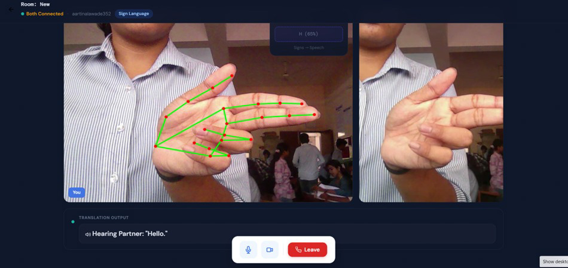
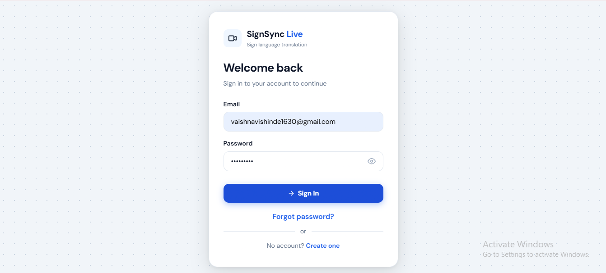
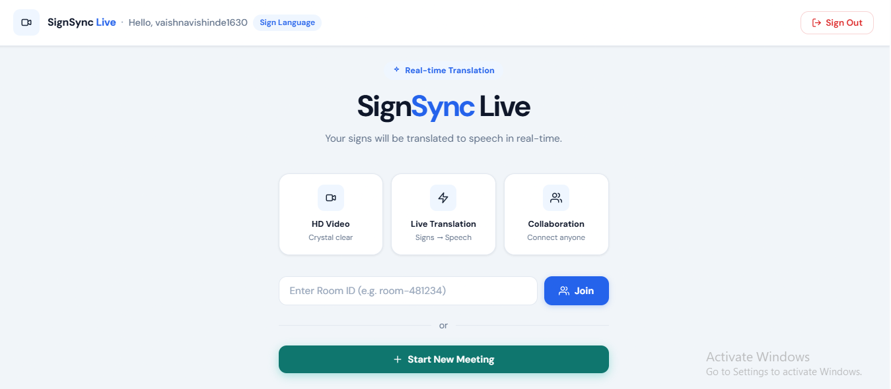
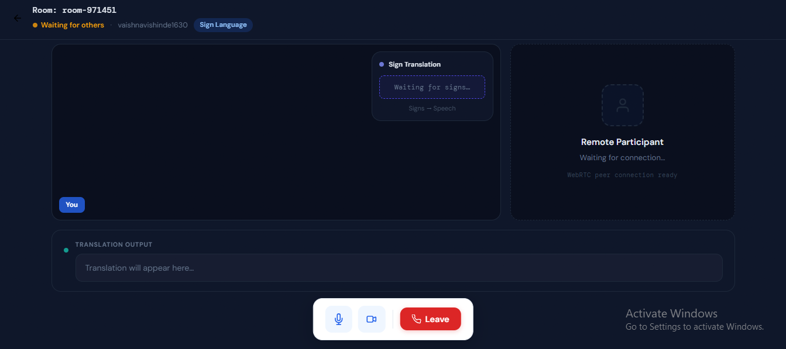
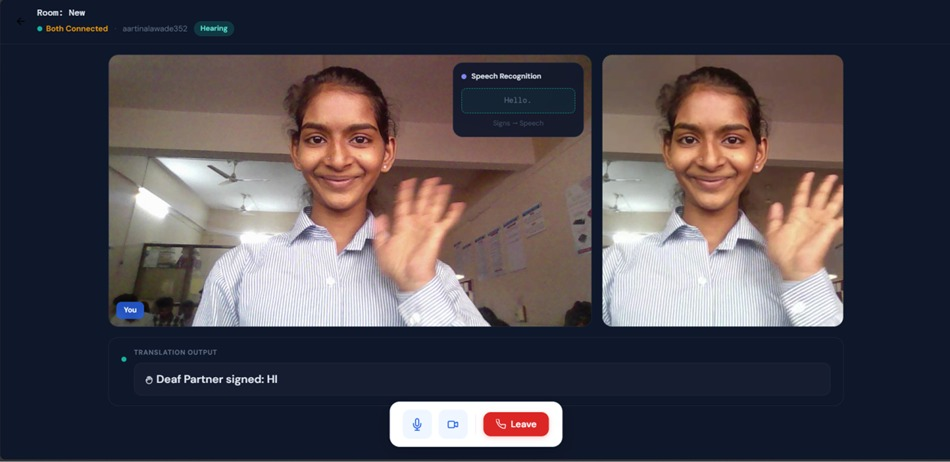

# SignSync Live
### Real-Time Sign Language Translation System

## Overview

SignSync Live is a real-time sign language translation system developed to improve communication between deaf or hearing-impaired individuals and hearing users.

The project uses Computer Vision and Machine Learning techniques to detect hand gestures through a webcam and convert them into text in real time. It also includes a video communication feature using WebRTC, allowing users to communicate more effectively during live conversations.

This project was developed as a Third-Year Engineering Mini Project using MediaPipe, Flask, Node.js, Socket.io, and Machine Learning technologies.

---

## Demo

The system captures hand gestures through a webcam, detects hand landmarks using MediaPipe, predicts the corresponding sign using a trained Machine Learning model, and displays the translated text in real time. The application also supports real-time video communication using WebRTC.

---

## Problem Statement

Many deaf and hearing-impaired individuals use sign language as their primary mode of communication. However, most people are not familiar with sign language, which creates communication barriers in everyday interactions.

The aim of this project is to develop a simple, affordable, and accessible system that can recognize sign language gestures using a standard webcam and translate them into text in real time.

---

## Features

- Real-time sign language recognition
- Hand landmark detection using MediaPipe
- Gesture classification using Machine Learning
- Flask API for prediction handling
- Real-time video communication using WebRTC
- Socket.io-based signaling system
- User-friendly web interface
- Webcam-based solution with no specialized hardware required

---

## Technologies Used

### Frontend
- HTML
- CSS
- JavaScript

### Backend
- Flask
- Node.js
- Express.js
- Socket.io

### Machine Learning & Computer Vision
- MediaPipe
- OpenCV
- NumPy
- Scikit-learn
- Random Forest Classifier

### Communication
- WebRTC
- Socket.io

---

## Working of the System

1. The webcam captures live video frames.
2. MediaPipe detects 21 hand landmarks from the user's hand.
3. Landmark coordinates are extracted and converted into feature vectors.
4. The features are normalized and sent to the Flask API.
5. The trained Random Forest model predicts the corresponding sign.
6. The translated output is displayed on the screen in real time.
7. WebRTC enables live communication between connected users.

---

## Screenshots

### Login Page

### User Type Selection

### Meeting Dashboard

### Video Communication Screen

### Real-Time Sign Detection (Deaf User Side)

### Hearing User Side

---

## Applications

- Communication support for deaf and hearing-impaired individuals
- Educational accessibility platforms
- Healthcare communication assistance
- Public service accessibility systems
- Assistive technology solutions

---

## Future Scope

- Dynamic gesture recognition
- Sentence-level sign language translation
- Mobile application development
- Support for additional sign languages
- Improved prediction accuracy using Deep Learning models

---

## Team Members

This project was developed as a collaborative Third-Year Engineering Mini Project by:

- Vaishnavi D. Shinde
- Purva H. Thorat

---

## Note

This repository is shared for academic, learning, and portfolio purposes.
